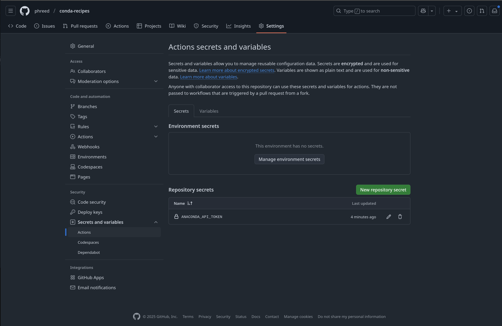

= Build conda recipes and upload them to your personal channel
:rust-forge: https://github.com/wolfv/rust-forge

== Origin

This is derived from link:{rust-forge}[rust-forge project].

== Tasks

The following pixi tasks are provided:

=== `pixi run build`

The build takes 3 parameters with defaults.

The following commands do the same thing.
The first example sets all the arguments, the second uses defaults.
[source,bash]
----
pixi run build-the digitalpy linux-64
pixi run build-the digitalpy
----

Build all of the packages in the default `pkgs` folder.
[source,bash]
----
pixi run build
----

=== `pixi run retract-pd`

Retract packages from prefix.dev channels. This permanently removes packages from the repository.

[source,bash]
----
pixi run retract-pd foo --channel mychannel --versions "1.0.0"
pixi run retract-pd foo --channel mychannel --versions "1.0.0,1.1.0,1.2.0"
pixi run retract-pd foo --channel mychannel --versions "1.0.0" --force
----

=== `pixi run retract-s3`

Retract packages from S3-based conda channels.

[source,bash]
----
pixi run retract-s3 foo --channel s3://my-bucket/channel --versions "1.0.0"
pixi run retract-s3-local foo --channel s3://local-bucket/channel --versions "1.0.0"
----

=== `pixi run retract-pd-dry`

Preview package retraction without actually deleting anything (dry run mode).

[source,bash]
----
pixi run retract-pd-dry foo --channel mychannel --versions "1.0.0"
pixi run retract-s3-dry foo --channel s3://my-bucket/channel --versions "1.0.0"
----

== Approach

The traditional approach to building software
not provided by a host package manager
is to build it from source on the same system it will be run on.
For unprivileged users running in HPC environments,
all software may need to be built from source.

The conda package format is a universal binary package format that
works in any installation prefix in privileged and unprivileged environments.
While originally developed for distributing Python packages,
The conda format now provides relocatable, precompiled packages for any language.
There is a rich set of tooling which may be used to
build, publish, and install conda packages.
This project uses the following tools:

* link:https://rattler.build/latest/[rattler-build]
* link:https://pixi.sh/latest/[pixi and pixi-build]
* link:https://docs.github.com/en/actions[github actions]
* link:https://prefix.dev/channels/meso-forge[meso-forge channel]
* link:https://anaconda.org/phread/dashboard[anaconda channel]
* link:https://min.io/product/s3-compatibility[S3 compatible MinIO Private channel]

The workflows in this repository provide an easy way to upload Conda recipes and
have the packages built and uploaded to a personal channel using GitHub Actions.
This means you don't have to build the Conda packages in an HPC environment or
in a virtual machine on your personal computer.
Instructions for doing this are provided in a
link:.resources/local-build.adoc[separate document].

Building and uploading Conda packages to a personal channel
should **not** be a substitute for submitting and maintaining these packages on:

* link:https://anaconda.org/conda-forge[conda-forge]

This setup should be used when developing and testing packages with
the intention of submitting them to upstream channels when they are ready.
Please see
link:{dan_nach_url}/wiki/Preparing-your-software-for-submission-to-conda-forge-or-bioconda[the wiki]
for more information on how you should prepare your software for public use.

== Using these workflow with your personal channel

Make a fork of the 'main' branch of this repository.

You will need to set up a personal Anaconda channel and
add an API key for the channel to the repository secrets.
See link:{dan_nach_url}/wiki/Creating-and-adding-an-Anaconda-API-token-to-the-repository-secrets[the wiki]
for a step-by-step walkthrough.

You will also want to modify the
link:.github/conda_channels[default channels configuration]
to use whatever channels you want.
The order of the channels in this config file determines their precedence for dependency resolution
- `pixi` will search for the dependency in the channels in the order they are given in the file.
You should usually leave the last 3 channels as `conda-forge`, `bioconda` and `nodefaults`
in that order so that any custom channels you add before them are checked first,
that `bioconda` is checked after `conda-forge`, and the legacy `defaults` channels are ignored.

== Adding new packages

To add a new package, clone the repository locally and create a new branch.
Each package recipe should be in its own folder with a `recipe.yaml`,
and when needed, a `build.sh` script.
Some complex recipes may use multiple shell scripts.

Push the branch to the repository and open a pull request from it.
Once the pull request has been opened,
the `rattler-build_linux-64.yml` workflow will attempt to build the recipes
using the `ratter-build_container.df` linux container image.
If the recipes build successfully,
you can merge the pull request to trigger the `rattler-build_upload.yml` workflow,
which will upload the conda packages to your personal channel.
This is the step that requires the `ANACONDA_API_TOKEN` secret and `ANACONDA_OWNER` variable.

=== Managing ANACONDA_API_TOKEN

The ANACONDA_API_TOKEN is used in the following jobs:
.github/workflows/dispatch_build_linux64.yml
[source,yaml]
----
include::.github/workflows/build-packages.yml[]
----

Previously, it was necessary to use a token but http://prefix.dev mesolab
allows prefered publishers.

==== Create the Anaconda Token

* Enable "Allow all operations"
* Choose an informative name
* Select an expiration date that is sufficiently far in the future

image:.resources/anacoda-token-creation.png[]

Copy the secret and then go to your fork of this repository and go to "Settings"

==== Register the Token for Github Action

The secret must be called ANACONDA_API_TOKEN, and you can paste the secret you copied before into here.

=== Managing RATTLER_AUTH_FILE

Rattler uses a configuration file to specify repositories and their permissions.

To do so it looks for that file in RATTLER_AUTH_FILE.
Probably something like ` $HOME/.config/rattler-auth.json`.

== Troubleshooting

Here is an example of how to run a build for `testresources`.
It pulls from two channels, `mesomorph` and `conda-forge`.
[source,bash]
----
PKG_NAME=node-red
rattler-build build --recipe "./packages/$PKG_NAME" --target-platform linux-64 --channel mesomorph --channel conda-forge
----

Uploading the constructed package.

[source,bash]
----
PACKAGE_FILE=$(find output -type f \( -name "*.conda" -o -name "*.tar.bz2" \) )
ANACONDA_OWNER: mesomorph
ANACONDA_API_KEY: ***
RATTLER_BUILD_LOG_STYLE: fancy
rattler-build upload anaconda -v $PACKAGE_FILE
----

https://www.mankier.com/1/secret-tool

Presume that the ANACONDA_API_KEY has been stored locally as a secret.

[source,bash]
----
echo -n <the anaconda api key token> | secret-tool store --label="ANACONDA_API_KEY" ANACONDA API_KEY
----
