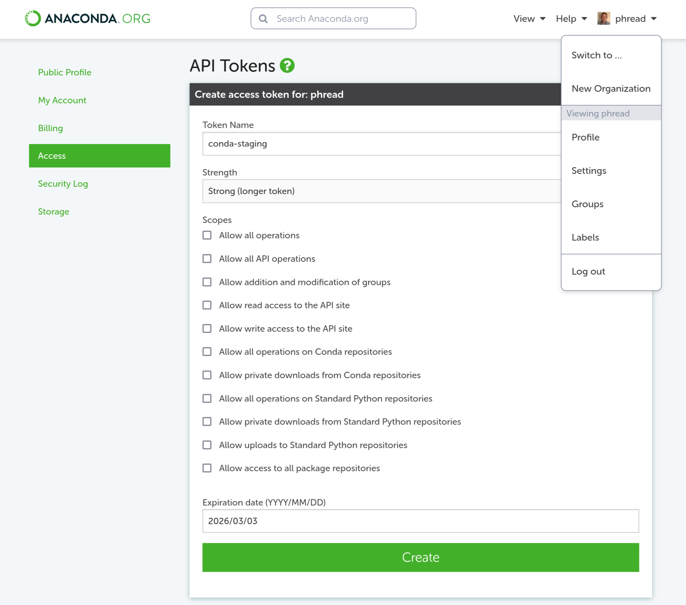

= Build conda recipes and upload them to your personal channel
:dan_nach_url: https://github.com/danielnachun/recipe_staging/

== Origin

This is derived from link:{dan_nach_url}[Daniel Nachun's recipe_staging project].
My motivation for making a fork is:
* I want to learn what is happening
* I do not want to contaminate the main branch with projects.
* I want to experiment with pixi.

== Approach

The traditional approach to building software not provided by a host package manager is to build it from source on the same system it will be run on.
For unprivileged users running in HPC environments, all software may need to be built from source.

The Conda package manager is a universal, binary package manager that
works in any installation prefix in privileged and unprivileged environments.
While originally developed for distributing Python packages,
Conda now provides relocatable, precompiled packages for any language.

The workflows in this repository provide an easy way to upload Conda recipes and
have the packages built and uploaded to a personal channel using GitHub Actions.
This means you don't have to build the Conda packages in an HPC environment or
in a virtual machine on your personal computer
(although instructions for doing this are provided in the wiki).

Building and uploading Conda packages to a personal channel should **not** be a substitute for
submitting and maintaining these packages on
link:https://anaconda.org/conda-forge[conda-forge] and
link:https://anaconda.org/bioconda[bioconda].
This setup should be used when developing and testing packages with
the intention of submitting them to upstream channels when they are ready.
Please see
link:{dan_nach_url}/wiki/Preparing-your-software-for-submission-to-conda-forge-or-bioconda[the wiki]
for more information on how you should prepare your software for public use.

== Using these workflow with your personal channel

Make a fork of the 'main' branch of this repository.

You will need to set up a personal Anaconda channel and add an API key for the channel to the repository secrets.
See link:{dan_nach_url}/wiki/Creating-and-adding-an-Anaconda-API-token-to-the-repository-secrets[the wiki]
for a step-by-step walkthrough.

You will also want to modify the
link:.github/conda_channels[default channels configuration]
to use whatever channels you want.
The order of the channels in this config file determines their precedence for dependency resolution
- `mamba` will search for the dependency in the channels in the order they are given in the file.
You should usually leave the last 3 channels as `conda-forge`, `bioconda` and `nodefaults` 
in that order so that any custom channels you add before them are checked first, 
that `bioconda` is checked after `conda-forge`, and the legacy `defaults` channels are ignored.

== Adding new packages

To add a new package, clone the repository locally and create a new branch.
Each package recipe should be in its own folder with a `meta.yaml`, and when needed, a `build.sh` script.
Some complex recipes may use multiple shell scripts.

Push the branch to the repository and open a pull request from it.
Once the pull request has been opened, the `conda_mambabuild` workflow will attempt to build the recipes using the `mambaforge` docker image.
If the recipes build successfully, 
you can merge the pull request to trigger the `anaconda_upload` workflow, 
which will upload the conda packages to your personal channel.
This is the step that requires the `ANACONDA_API_TOKEN` secret.

=== Managing ANACONDA_API_TOKEN

The ANACONDA_API_TOKEN is used in the following jobs:
.github/workflows/dispatch_build_linux64.yml
[source,yaml]
include::.github/workflows/dispatch_build_linux-64.yml[tag=api_token]

[source,yaml]
include::.github/workflows/dispatch_build_osx-64.yml[tag=api_token]

[source,yaml]
include::.github/workflows/dispatch_build_osx-arm64.yml[tag=api_token]

[source,yaml]
include::.github/workflows/rattler-build_upload.yml[tag=api_token]

==== Create the Anaconda Token

* Enable "Allow all operations"
* Choose an informative name
* Select an expiration date that is sufficiently far in the future

Copy the secret and then go to your fork of this repository and go to "Settings"

==== Register the Token for Github Action

The secret must be called ANACONDA_API_TOKEN, and you can paste the secret you copied before into here.

image:.docs/github-action-secret.png[]
